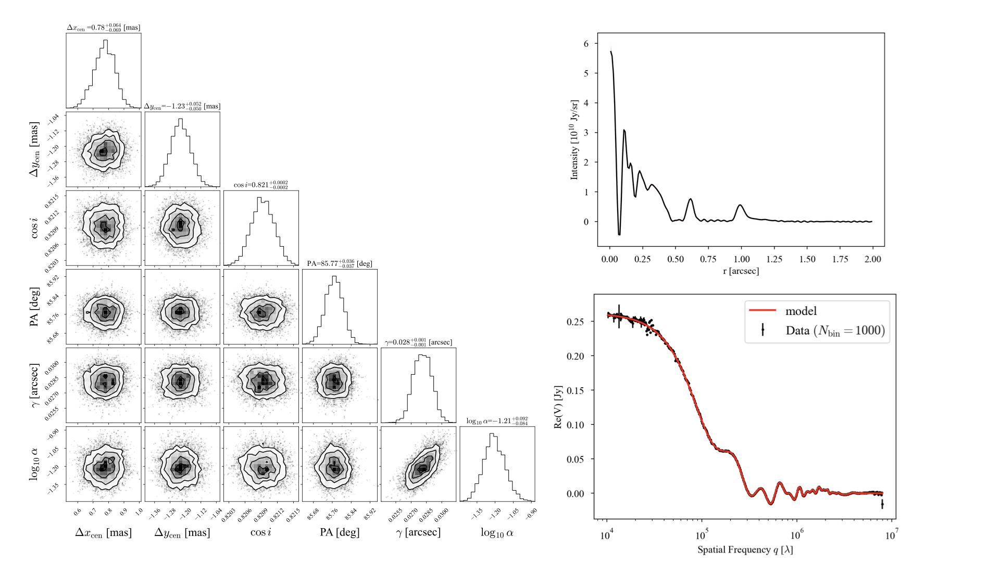

# georadial
Estimating itensity radial profile & geometry & hyperparameters proto-planetary disks in ALMA  
- For technical details of algorithm and mathematic background, you can find them in Aizawa, Muto, Momose 2023

## Install 
For normal install, 
* python setup.py install or pip install ./georadial

For developers, 
* python setup.py develop or pip install -e ./georadial
    
## Prerequisites
- astropy, emcee, corner, matplotlib, numpy, scipy, pandas, (Jupyter notebook)

## Usage

### 1) MCMC run
1. Download test data from https://github.com/2ndmk2/dsharp_averaged_data
   - **If you use your own data**, You have to convert ".ms" file to ".npz" file that should have columns
       - "u_obs": Spatial frequency "u" [lamnbda]
       - "v_obs": Spatial frequency "v" [lamnbda]
       - "vis_obs": Visibility 
       - "wgt_obs": Weights
3. Make "vis_data" folder ant put the data there
4. Move to "tests" folder
5. Run "bash run.sh"  
   - Modify config files (See Appendix in end of this page) as you need  
   - Option "--n_process" determines the number of cores you use for mcmc (default 3)  
   - **This step is most time consuming. Need ~1.5 hours to finish (32 walkers, 1000 steps) with 16 cores.**

### 2) Postprocess after MCMC

1. Modify "model_calc.py" as you like
    - *n_sample_for_rad*: Number of smaples for intensity profiles
    - *n_burnin*: Number of Burnin samples
    - *mcmc_result_file*: path to "~~vis_mcmc.npz" output from run.sh
    - *visfile*: path to "~~vis.npz" output from run.sh
    - *out_file_for_model*: path to output file from "model_calc.py"
2. Calculate model itensity & visibility profile using "model_calc.py"

### 3) See result
1. Run mcmc_plotter.ipynb
   - *samplefile*: path to "~~vis_mcmc.npz" output from run.sh
   - *modelfile*: path to output file from model_calc.py
   
------

# Appendix
## Config files
**[mcmc_config.dat]**  
Parameters for emcee and model  

- *Nrad*: Number of radial point for model intensity)  
- *Nbin*: Determine binning grid. Grid size is (2*Nbin+1, 2*Nbin+1)  
- *Dpix*: Radial spacing for model [arcsec]. Outer disk radius is determined as "Rout = Nrad * Dpix"  
- *Nwalker*: Number of walkers for emcee)  
- *Nchain*: Number of chains for emcee)  
- *cov*: Choice of regularization (default is RBF)  
- *out_folder*: Path to output folder  

**[AS209_paradic.dat]**  
Parameters determining initial positions for mcmc.  
They are randonly generated with uniform distribution [value-scatter/2,value+scatter/2].  

**[prior.dat]**  
Parameters determining parameter priors.  
- prior for alpha: Uniform prior for [log10_alpha_min, log10_alpha_max]  
- prior for gamma: Uniform prior for [min_scale [arcsec], max_scale  [arcsec]]  
- prior for disk center: Uniform prior for [-delta_pos [arcsec], delta_pos  [arcsec]]  
